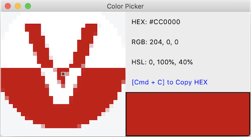
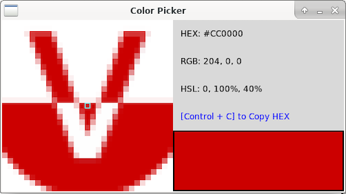
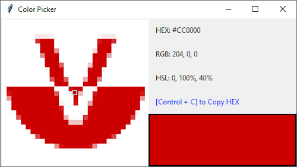

# cl-pkr
Cross-Platform Color Picker Written in Common Lisp

> with help of [Tcl/Tk](https://www.tcl.tk/)

### Downloads:

Check [Releases Page](https://github.com/VitoVan/cl-pkr/releases) to get the latest version.

### Screenshots:

- macOS

  

- Linux

  

- Windows

  

----

### Hacking:

1. Make sure you have SBCL with Quicklisp installed

    - Install a proper SBCL, you can download [here](http://www.sbcl.org/platform-table.html)
    - Install Quicklisp, you can follow the tutorial [here](https://www.quicklisp.org/beta/#installation)

2. Make sure you have a bin folder and have a proper tclkit inside

    - `mkdir -p bin` or just right click to create a folder name `bin`
    - Download yourself a proper tclkit and rename it to `tclkit-gui` [here](https://github.com/VitoVan/kitgen/releases/tag/8.6.9)

3. build your application

    ```bash
    sbcl --disable-debugger --load cl-pkr.asd --eval "(ql:quickload 'cl-pkr)" --eval "(asdf:make :cl-pkr)"
    ```

Voilà! Check your `bin` folder for the magic!

### Deploy:

Use [Travis CI](https://travis-ci.com/) for the good of your health, you need to change the `deploy` section in the `.travis.yml` file.

  ```yml
  deploy:
    provider: releases
    api_key:
      secure: ouovl9...52XIY0= # <------ get yourself a api_key
    file_glob: true
    file: ./*.zip
    skip_cleanup: true
    overwrite: true
    draft: true
    on:
      repo: VitoVan/cl-pkr # <------ change this to your own repo
  ```

Links below may help a little:

https://docs.travis-ci.com/user/deployment/releases/#authenticating-with-an-oauth-token

https://docs.travis-ci.com/user/deployment#conditional-releases-with-on

### Credits

- Icon made by [DinosoftLabs](https://www.flaticon.com/authors/dinosoftlabs) from www.flaticon.com

- Tclkit build system http://tclkit.googlecode.com/, [forked](https://github.com/VitoVan/kitgen).

