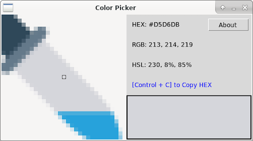
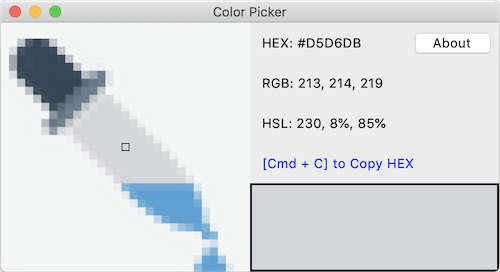
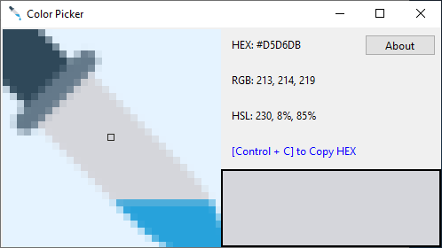

# cl-pkr
Cross-Platform Color Picker Written in Common Lisp

 [](https://travis-ci.com/VitoVan/cl-pkr)

### Screenshots:

- Linux

  

- macOS

  

- Windows

  

### Downloads:

- Linux

    [](<https://github.com/VitoVan/cl-pkr/releases/latest/download/color-picker.AppImage>)

- macOS

    [](<https://github.com/VitoVan/cl-pkr/releases/latest/download/color-picker.app.zip>)

- Windows

    [](<https://github.com/VitoVan/cl-pkr/releases/latest/download/color-picker.exe>
    )

> You are supposed to run it on a 64-bit machine

> Tested on Fedora 30, macOS Mojave and Windows 10 1809

### Usage:

- On macOS:
    - [Cmd + C] to Copy HEX
    - [Cmd + Shift + C] to Copy RGB
    - [Cmd + Option + C] to Copy HSL

- On Windows or Linux
    - [Control + C] to Copy HEX
    - [Control + Shift + C] to Copy RGB
    - [Control + Alt + C] to Copy HSL

### Known Issues:

- Multi-Monitor not supported
    You can only pick color from the main display

### Related Links:

- [Meditations on Color Picker](http://vito.sdf.org/picker.html)

- [cl-icebox](https://github.com/VitoVan/cl-icebox) Cross-Platform GUI framework written in Common Lisp

----

### Hacking:

1. Make sure you have SBCL with Quicklisp installed

    - Install a proper SBCL, you can download [here](http://www.sbcl.org/platform-table.html)
    - Install Quicklisp, you can follow the tutorial [here](https://www.quicklisp.org/beta/#installation)

2. Make sure you have a bin folder and have a proper tclkit inside

    - `mkdir -p bin` or just right click to create a folder name `bin`
    - Download yourself a proper tclkit and rename it to `tclkit-gui` [here](https://github.com/VitoVan/kitgen/releases/latest)

3. build your application

    ```bash
    sbcl --disable-debugger --load cl-pkr.asd --eval "(ql:quickload 'cl-pkr)" --eval "(asdf:make :cl-pkr)"
    ```

Voilà! Check your `bin` folder for the magic!

> What? You use [Emacs](https://www.gnu.org/software/emacs/) and [SLIME](https://common-lisp.net/project/slime/)? Great!

> Eval `(progn (load "cl-pkr.asd") (ql:quickload 'cl-pkr) (setf cl-icebox::*hacking* t))` in your REPL, then you can call `(cl-pkr:color-picker)`, have fun!

### Deploy:

Please check `deploy.sh` and `.github/workflows` for more information.

### Credits

- Icon made by [DinosoftLabs](https://www.flaticon.com/authors/dinosoftlabs) from www.flaticon.com
- [Tcl/Tk](https://www.tcl.tk/)
- Tclkit build system http://tclkit.googlecode.com/, [forked here](https://github.com/VitoVan/kitgen)
- [Resource Hacker](http://www.angusj.com/resourcehacker/)
- [Warp](https://github.com/dgiagio/warp)
- [AppImage](https://appimage.org/)

---


